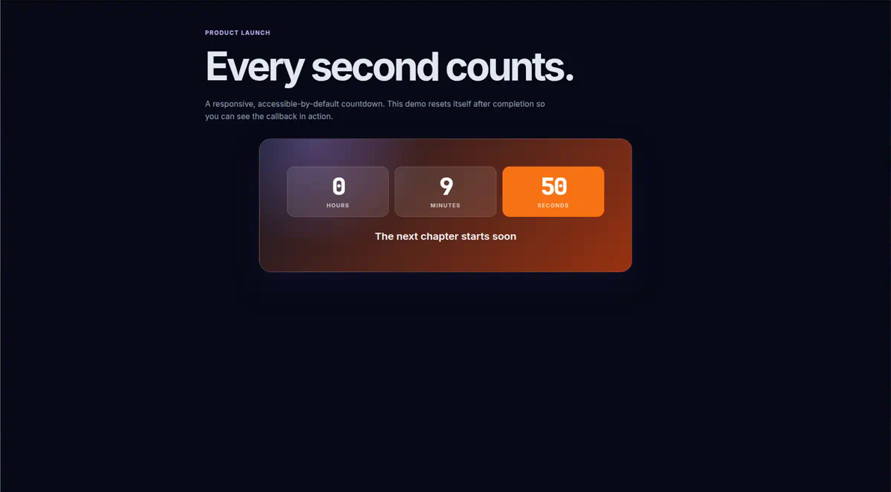

## Awesome Countdown

A small, customizable JavaScript countdown with a responsive default UI, lifecycle controls, and callbacks for when time runs out.



### Install
`npm install awesome-countdown`

### Usage
Load `src/style.css` in your page (or include it from your bundler), then create a countdown:

```js
const AwesomeCountdown = require("awesome-countdown");
const moment = require("moment");
const END_DATE = moment().add(2, "hours");

const countdown = new AwesomeCountdown({
    end: END_DATE,
    domId: "demo",
    showYear: false,
    showMonth: false,
    showDay: false,
    claim: "Registration closes soon",
    onTick(remaining) {
        console.log(`${remaining.minutes} minutes left`);
    },
    callback(instance) {
        console.log("Countdown complete");
        instance.stop();
    }
});

countdown.run();
```

`run()`, `stop()`, and `reset()` are the preferred lifecycle API. The original `_run()`, `_stop()`, and `_reset()` aliases remain available for compatibility.

### Parameters
Name | Description | Required | Type | Default
-----|-------------|----------|------|--------
callback|a callback function called at the end of countdown|false|function|null
onTick|a callback function called each time the displayed value updates; receives `(remaining, countdown)`|false|function|null
start|time to start the countdown|false|string YYYY-MM-DD HH:mm:ss or moment|moment()
end|time to end the countdown|true|string YYYY-MM-DD HH:mm:ss or moment|null
showYear|show year value|false|boolean|true
showMonth|show month value|false|boolean|true
showDay|show day value|false|boolean|true
showHour|show hour value|false|boolean|true
showMinute|show minute value|false|boolean|true
refreshRate|countdown refresh rate|false|milliseconds|1000 ms
hidden|hide the countdown|false|boolean|false
claim|the text displayed under the countdown|false|string|null
class|an additional custom class for the countdown|false|string|null
domId|DOM ID where the countdown is mounted|false|string|null
lang|language for the labels|false|string or object|en

`claim` accepts HTML for backwards compatibility. Only pass trusted content to it.

### Methods
Name | Description
-----|------------
run|start the countdown; returns the instance for chaining
stop|stop the countdown; returns the instance
reset|recreate and restart the countdown
getRemaining|return the current `{ years, months, days, hours, minutes, seconds }`, or `null` before `start`

### Demo
Run `npm run build:demo`, then serve the repository root and open [`examples/index.html`](examples/index.html). The demo is also the source for the screenshot above.

### License
Code released under [MIT License](https://github.com/mnossa/awesome-countdown/blob/master/LICENSE)